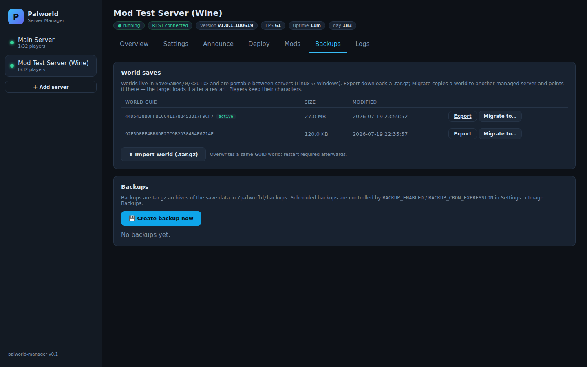
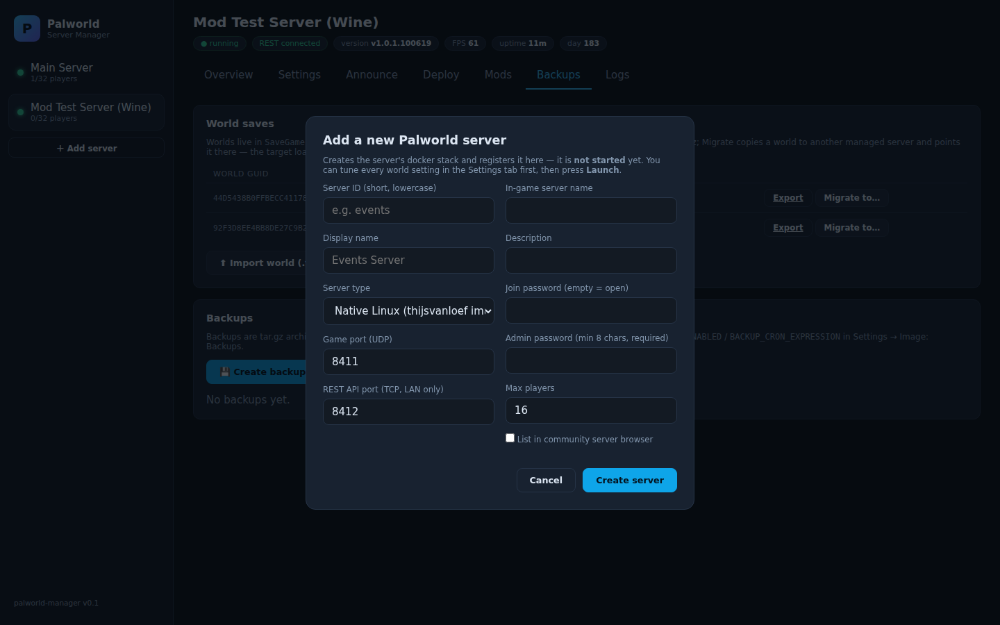

# Palworld Server Manager

**A clean web UI for running Palworld dedicated servers in Docker** — settings,
mods, announcements, deploys, backups and world migration, for one server or a
whole fleet.

Works with [thijsvanloef/palworld-server-docker](https://github.com/thijsvanloef/palworld-server-docker)
(native Linux) and [palworld-docker-wine](https://github.com/1tsmejp/palworld-docker-wine)
(Windows build under Wine — full mod support) side by side, and knows the
difference: mod compatibility, install strategy and available settings adapt
per server.

> ⚠️ **Deploy and test at your own risk.** This tool edits compose files,
> restarts game servers and installs mods on your behalf. It ships with
> validation, backups and confirmation steps — but it's a community project.
> Keep backups and try it against a test server first.

## Features


**Live dashboard** — status, player list, FPS, uptime, in-game day for every
managed server, via the game's own REST API. Kick/ban from the player list.


**Every setting, validated** — all 179 world/server/image settings with min/max
guardrails, sliders, image defaults, and search. Values are written to the
server's compose environment (the single source of truth), with
**config-drift detection** when a running container no longer matches its
compose file — one click adopts the live values.


**Review & deploy** — setting edits and mod installs stage as pending changes.
One deploy runs the whole pipeline: in-game countdown announcements → world
save → compose update (timestamped backup) → container recreate → wait for
online → **validate every change against the live server**, with a live step log.


**Steam Workshop mod browser** — search, sort and install without leaving the
UI. Sign in once with your Steam mobile app (QR — no password typed) and
installs run through the game container's own DepotDownloader. Mods are
type-classified per server (pak-only on native Linux, everything on
Windows/Wine), dependency warnings included, plus Nexus Mods browsing with an
API key and manual `.pak` upload.



**Backups & world migration** — list/create/download backups, and export,
import or **migrate whole worlds between servers** (Linux ↔ Windows) with
optional fresh world GUID, `WorldOption.sav` stripping, and an automatic
announced restart.



**Provision servers from the UI** — the Add Server wizard generates a new
docker stack (native or Wine flavor, ports validated), registers it
*unlaunched* so you can tune every setting first, then launches it on click.

## Quick start

```bash
git clone https://github.com/1tsmejp/palworld-server-manager.git && cd palworld-server-manager
# 1. edit config/servers.json  — point it at your Palworld stack(s)
# 2. edit deploy/docker-compose.yml — set MANAGER_PASSWORD and the stack mount
docker compose -f deploy/docker-compose.yml up -d --build
```

Open `http://<host>:8220` — any username, password = `MANAGER_PASSWORD`.

**Requirements:** the manager container needs `/var/run/docker.sock` and a
mount of each managed stack's directory (so it can read/edit that stack's
`docker-compose.yml`). The game servers need `REST_API_ENABLED=true` (default
in recent images). The game's `ADMIN_PASSWORD` is read from each stack's
compose env automatically.

### servers.json

```jsonc
{
  "managerPort": 8220,
  "hostAddress": "host.docker.internal",   // how the manager reaches game REST ports
  "servers": [
    {
      "id": "my-server",                    // short unique id
      "name": "My Palworld Server",         // display name
      "composeFile": "/stacks/palworld/docker-compose.yml",  // path INSIDE the manager container
      "composeProject": "palworld",         // compose -p project name
      "serviceName": "palworld",            // service key in the compose file
      "containerName": "palworld-server",
      "apiUrl": "http://host.docker.internal:8212",
      "flavor": "thijsvanloef"              // or "wine" for Windows-build servers
    }
  ]
}
```

## How it works

Node 22 + Express + vanilla JS, no database. State lives where it should:
settings in each server's compose file, history in JSONL files, live data in
the game's REST API. The settings catalog is generated from the server image's
own settings template (`npm run generate-schema` after game updates — see
`tools/`). Mod/steam credentials are stored only in the manager's data volume,
never in stack files.

## License

MIT. Not affiliated with Pocketpair. Game data shown in screenshots comes from
the public Steam Workshop.
